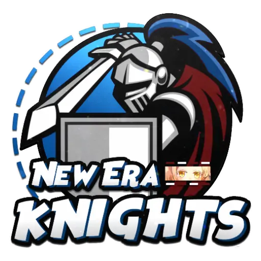

# My Tournaments New Era Knights
This is a simple api to manage tournaments. It is written in Node.js and uses _NestJS_ as a framework along with Typescript.

## Why?
I created this project to help my local yu-gi-oh community to manage their tournaments and can be used by any other community that needs to manage their tournaments.

## Has a frontend?
Not _yet_, but I'm planning to create a frontend using Vue.js or React.js.
### Why?
To be honest i'm much more familiar with React.js, but i'm planning to use Vue.js because i want to learn more about it and i think it is a good opportunity to learn it.

## The architecture
The project is using a clean architecture, so it is easy to change the database or the framework used. Thats why i'm also using Domain Driven Design to separate the business logic from the framework.

### The Workflow
This is how i'm working on the project, is not the functional requirements, but the steps that i'm following to create the project.

1. Do the business logic in the **domain layer**
2. Create the **use cases** in the application layer and the tests
3. Choose the **framework** that i'll use to deal with the **HTTP requests**
4. Choose the **database** and create the repository that i'll use to deal with the database (_By the way, the repository is in the infrastructure layer and working with local memory for now, i'm using the repository pattern to make it easy to change the database in the future_)
5. Create the infrastructure local with **Docker and Docker Compose** to up the database and any other service that i'll need
6. Create the **controller** that will call the use cases and return the response to the client and the tests
7. Create the **routes** that will call the controller
9. (_Optional_) Use GraphQL to create separate queries and mutations and make it easy to create a frontend
10. (_Optional_) Create the frontend


## Tests
The project is using Vitest to run the tests. To run the tests, just run the command `npm run test:e2e`.
Also all features that are created i did a TDD approach.

# Installation
You need to have NodeJS and Docker in your machine
1. Clone the repository
2. Install dependencies `npm install`
3. Create _.env_ file. You can find what you need to do so at _.env.example_
4. Run docker compose or connect to your own MongoDB database `docker compose up -d`
5. Start project `npm run start:dev`

# Tournament API Reference

Base URL: `/tournament`

## Endpoints:

### 1. **Create a Tournament**
   - **POST** `/`
   - **Description**: Creates a new tournament.
   - **Request Body**:
     ```json
     {
       "name": "string",
       "date": "string (ISO date)",
       "time": "string (e.g., '14:00')",
       "description": "string",
       "is_free": "boolean",
       "max_quorum": "number",
       "min_quorum": "number",
       "ticket": "string"
     }
     ```
   - **Response**:
     ```json
     {
       "message": "Tournament created successfully, here is the secret key to control the tournament",
       "tournament_key": "string",
       "tournament_id": "string"
     }
     ```
     The **`tournament_key`** field will be **required** for manager the tournament. **DO NOT SHARE IT!**
   - **Errors**: 
     - `400 Bad Request`: If required fields are missing.

---

### 2. **List Tournaments**
   - **GET** `/`
   - **Description**: Fetches a list of tournaments.
   - **Request Body** *(Optional)*:
     ```json
     {
       "open": "boolean"  // Defaults to true if not provided
     }
     ```
   - **Response**:
     ```json
     {
       "tournaments": [
         {
           "id": "string",
           "name": "string",
           "date": "string (ISO date)",
           "time": "string",
           "description": "string",
           "is_free": "boolean",
           "max_quorum": "number",
           "min_quorum": "number",
           "ticket": "string",
           "is_open": "boolean",
           "players": ["player_id"]
         }
       ]
     }
     ```
   - **Errors**: 
     - `500 Internal Server Error`: If there’s a server issue.

---

### 3. **Get Tournament by ID**
   - **GET** `/:id`
   - **Description**: Fetches details of a tournament by its ID.
   - **URL Parameters**:
     - `id` *(required)*: The ID of the tournament.
   - **Response**:
     ```json
     {
       "message": "Tournament found",
       "tournament": {
         "id": "string",
         "name": "string",
         "date": "string (ISO date)",
         "time": "string",
         "description": "string",
         "is_free": "boolean",
         "max_quorum": "number",
         "min_quorum": "number",
         "ticket": "string",
         "is_open": "boolean",
         "players": [{
            "_id": "string",
            "name": "string",
            "deck_list": "string"
        }]
       }
     }
     ```
   - **Response if tournament are closed**
   ```json
         {
       "message": "Tournament found",
       "tournament": {
         "id": "string",
         "name": "string",
         "date": "string (ISO date)",
         "time": "string",
         "description": "string",
         "is_free": "boolean",
         "max_quorum": "number",
         "min_quorum": "number",
         "ticket": "string",
         "is_open": "boolean",
         "players": [{
            "_id": "string",
            "name": "string",
            "deck_list": {
                    "_id": "string",
                    "deck_name": "string",
                    "main_deck": [{
                        "id_card_pro": "string",
                        "card_name": "string",
                        "image_url": "string",
                        "quantity": "number",
                        "_id": "string"
                    }],
                    "extra_deck": [{
                        "id_card_pro": "string",
                        "card_name": "string",
                        "image_url": "string",
                        "quantity": "number",
                        "_id": "string"
                    }],
                    "side_deck": [{
                        "id_card_pro": "string",
                        "card_name": "string",
                        "image_url": "string",
                        "quantity": "number",
                        "_id": "string"
                    }]
                }
        }]
       }
     }
   ```
   - **Errors**: 
     - `400 Bad Request`: If the tournament ID is missing.
     - `404 Not Found`: If no tournament is found for the given ID.

---

### 4. **Close Tournament**
   - **PATCH** `/:id`
   - **Description**: Closes an existing tournament.
   - **URL Parameters**:
     - `id` *(required)*: The ID of the tournament.
   - **Request Body**:
     ```json
     {
       "key": "string" // Secret key required to close the tournament
     }
     ```
   - **Response**:
     ```json
     {
       "message": "Tournament closed successfully"
     }
     ```
   - **Errors**:
     - `400 Bad Request`: If the tournament ID or key is missing.
     - `401 Unauthorized`: If the key provided is incorrect.
     - `500 Internal Server Error`: If there’s a server issue.

---

This API allows clients to create, retrieve, list, and close tournaments. Ensure the correct data is provided for each request to avoid errors.


Thanks for the clarification! Here’s the updated API reference reflecting the correct deck fields:

---

# Player API Reference

Base URL: `/player`

## Endpoints:

### 1. **Register a Player to a Tournament**
   - **POST** `/:id`
   - **Description**: Registers a player for a specific tournament by creating a deck list and assigning it to the player.
   - **URL Parameters**:
     - `id` *(required)*: The ID of the tournament the player is registering for.
   - **Request Body**:
     ```json
     {
       "player_name": "string", 
       "deck_name": "string",
       "main_deck": [
         {
           "id_card_pro": "string",
           "card_name": "string",
           "image_url": "string",
           "quantity": "number"
         }
       ],
       "extra_deck": [
         {
           "id_card_pro": "string",
           "card_name": "string",
           "image_url": "string",
           "quantity": "number"
         }
       ],
       "side_deck": [
         {
           "id_card_pro": "string",
           "card_name": "string",
           "image_url": "string",
           "quantity": "number"
         }
       ]
     }
     ```
     - **Fields**:
       - `player_name` *(required)*: Name of the player.
       - `deck_name` *(required)*: Name of the deck being created.
       - `main_deck` *(required)*: Array of objects representing cards in the main deck.
       - `extra_deck` *(required)*: Array of objects representing cards in the extra deck.
       - `side_deck` *(required)*: Array of objects representing cards in the side deck.
     - **Card Object**:
       - The cards Objects use as base the [YGOPROAPI](https://ygoprodeck.com/api-guide/) and if you are trying to create a front end using this API, see the endpoints from the API.
       - `id_card_pro` *(required)*: The ID of the card.
       - `card_name` *(required)*: The name of the card.
       - `image_url` *(required)*: The URL of the card's image.
       - `quantity` *(required)*: The quantity of this card in the deck.
   
   - **Response**:
     ```json
     {
       "message": "string"
     }
     ```
   - **Errors**: 
     - `400 Bad Request`: If the required fields (`player_name`, `deck_name`, `main_deck`, etc.) or the tournament ID are missing.
     - `500 Internal Server Error`: If there’s a server-side issue.

---

### Workflow Summary:

1. **Deck Creation**: The API accepts details about the decks (`main_deck`, `extra_deck`, and `side_deck`). These decks are composed of card objects containing the `id_card_pro`, `card_name`, `image_url`, and `quantity`.
2. **Deck List Creation**: The card data is processed and associated with a deck list, which is then linked to the player using `CreateDeckListUseCase`.
3. **Tournament Registration**: Finally, the player and their deck list are registered to the tournament using `RegisterToTournamentUseCase`.

This endpoint ensures that the player is registered to the tournament and receives a confirmation message upon successful registration.